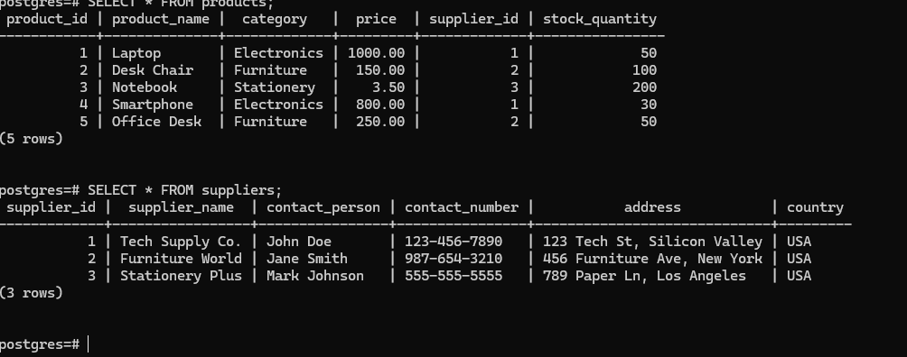
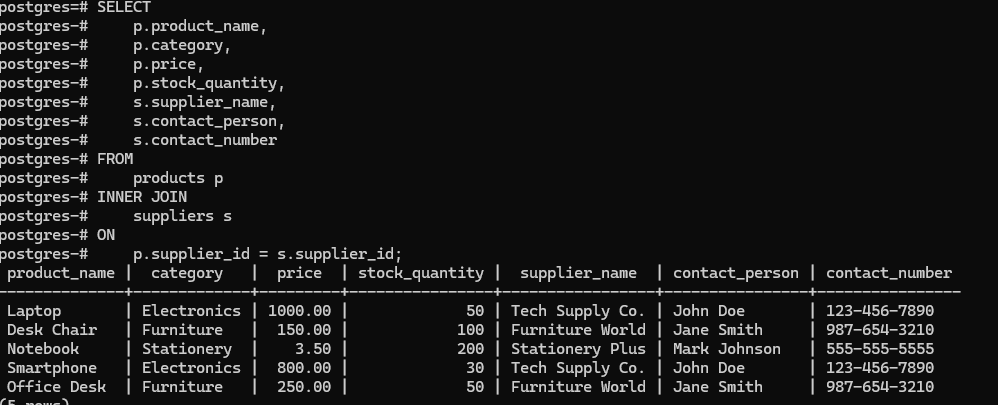
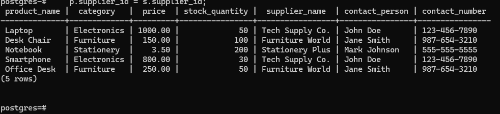
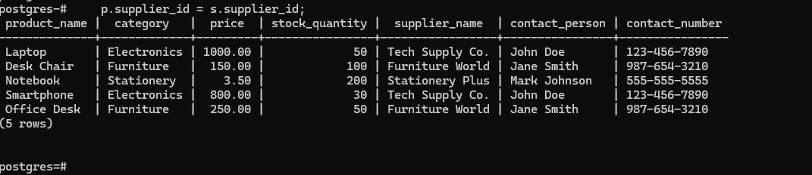

# SQL Joins Documentation
This README provides documentation and examples of SQL joins, including INNER JOIN, LEFT JOIN, RIGHT JOIN, and FULL JOIN  and also the ACID Properties including normalization,first normal form, second normal form, third normal form, boyce codd normal form, fourth normal form in PostgreSQL.
## Table of Contents
- [INNER JOIN](#inner-join)
- [LEFT JOIN](#left-join)
- [RIGHT JOIN](#right-join)
- [FULL JOIN](#full-join)
- [ACID PROPERTIES ]
- [NORMALIZATION]
- [FIRST NORMAL FORM]
- [SECOND NORMAL FORM]
- [THIRD NORMAL FORM]
- [BOYCE CODD NORMAL FORM]
- [FOURTH NORMAL FORM]


## INNER JOIN
Inner joins combine records from two tables whenever there are matching values in a field common to both tables.

## THE SYNTAX

```sql
SELECT column_list
FROM table1
INNER JOIN table2
ON table1.column = table2.column;
```

## EXAMPLE

an INNER JOIN on the products and suppliers tables to retrieve the products along with the details of their respective suppliers.


The INNER JOIN will return only the rows where there is a match between products.supplier_id and suppliers.supplier_id. This means only the products with valid supplier information will appear in the result.

## INNER JOIN Example

This is the result of an INNER JOIN between `products` and `suppliers`:



## LEFT JOIN
is a type of SQL JOIN operation that retrieves all records from the left table (table1) and the matching records from the right table (table2)

## SYNTAX

```SELECT 
    columns
FROM 
    left_table
LEFT JOIN 
    right_table
ON 
    left_table.column = right_table.column;
```


## EXAMPLE

```SELECT 
    p.product_name, 
    p.category, 
    p.price, 
    p.stock_quantity, 
    s.supplier_name, 
    s.contact_person, 
    s.contact_number
FROM 
    products p
LEFT JOIN 
    suppliers s
ON 
    p.supplier_id = s.supplier_id;
```    

## LEFT JOIN Example

This is the result of an LEFT JOIN between `products` and `suppliers`:
  

## RIGHT JOIN

Right joins are similar to left joins except they return all rows from the table in the RIGHT JOIN clause and only matching rows from the table in the FROM clause. 

## SYNTAX
```SELECT 
    columns
FROM 
    left_table
RIGHT JOIN 
    right_table
ON 
    left_table.column = right_table.column;
```

 ## RIGHT JOIN EXAMPLE

 ```SELECT 
    p.product_name, 
    p.category, 
    p.price, 
    p.stock_quantity, 
    s.supplier_name, 
    s.contact_person, 
    s.contact_number
FROM 
    products p
RIGHT JOIN 
    suppliers s
ON 
    p.supplier_id = s.supplier_id;
```

This is the result of an LEFT JOIN between `products` and `suppliers`:
  

# ACID Properties and Database Normalization

## Table of Contents
1. [ACID Properties](#acid-properties)
   - [Atomicity](#atomicity)
   - [Consistency](#consistency)
   - [Isolation](#isolation)
   - [Durability](#durability)
2. [Normalization](#normalization)
   - [First Normal Form (1NF)](#first-normal-form-1nf)
   - [Second Normal Form (2NF)](#second-normal-form-2nf)
   - [Third Normal Form (3NF)](#third-normal-form-3nf)
   - [Fourth Normal Form (4NF)](#fourth-normal-form-4nf)
   - [Boyce-Codd Normal Form (BCNF)](#boyce-codd-normal-form-bcnf)

---

## ACID Properties

ACID is an acronym that represents four key properties that guarantee reliable processing of database transactions:

### Atomicity
- **Definition**: A transaction is treated as a single unit of work that either completes entirely or not at all. If any part of the transaction fails, the entire transaction is rolled back.
- **Importance**: Ensures that partial updates do not leave the database in an inconsistent state.

### Consistency
- **Definition**: Transactions must take the database from one valid state to another, maintaining all predefined rules, including integrity constraints.
- **Importance**: If a transaction violates any rules, it will not be committed, thus maintaining data integrity.

### Isolation
- **Definition**: Transactions are executed in isolation from one another. The intermediate state of a transaction is not visible to other transactions until it is committed.
- **Importance**: Prevents dirty reads and ensures transaction integrity by isolating transactions.

### Durability
- **Definition**: Once a transaction is committed, its effects are permanent, even in the case of a system failure.
- **Importance**: Ensures that committed transactions remain intact through system crashes or failures.

---

## Normalization

Normalization is the process of organizing data in a database to reduce redundancy and improve data integrity. It involves dividing a database into tables and defining relationships between them.

### First Normal Form (1NF)
- **Definition**: A table is in 1NF if:
  - All columns contain atomic (indivisible) values.
  - Each column contains values of a single type.
  - Each column must have a unique name.
  - The order in which data is stored does not matter.
  
- **Example**:
  ```plaintext
  | StudentID | Courses          |
  |-----------|------------------|
  | 1         | Math, Science    |  (Not in 1NF)


# converted to 1nf
| StudentID | Course   |
|-----------|----------|
| 1         | Math     |
| 1         | Science  |  (Now in 1NF)

## Second Normal Form (2NF)

### Definition
A table is in 2NF if:
- It is in 1NF.
- All non-key attributes are fully functionally dependent on the primary key. No non-key attribute should depend on part of a composite primary key.

### Example

In this example, the `Instructor` is not fully dependent on the `StudentID` and `Course` composite primary key because it varies based on the `Course` only.

**Converted to 2NF:**


---

## Third Normal Form (3NF)

### Definition
A table is in 3NF if:
- It is in 2NF.
- All attributes are functionally dependent only on the primary key, and there are no transitive dependencies.

### Example

**Not in 3NF:**
 
Here, `InstructorOffice` is transitively dependent on the `Instructor`, violating the 3NF rules.

**Converted to 3NF:**

---

## Fourth Normal Form (4NF)

### Definition
A table is in 4NF if:
- It is in 3NF.
- It does not contain any multi-valued dependencies.

### Example

**Not in 4NF:**

In this case, the `Hobby` field contains multiple values for the same `StudentID` and `Course`, creating a multi-valued dependency.

**Converted to 4NF:**

---

## Boyce-Codd Normal Form (BCNF)

### Definition
A table is in BCNF if:
- It is in 3NF.
- For every functional dependency (A → B), A should be a super key.

### Example

**Not in BCNF:**

Here, the `Instructor` is dependent on the `Course`, which is not  super key.

**Converted to BCNF:**

